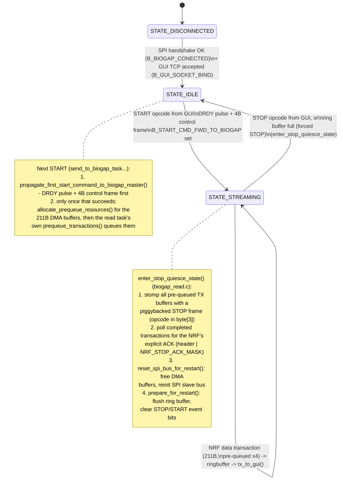
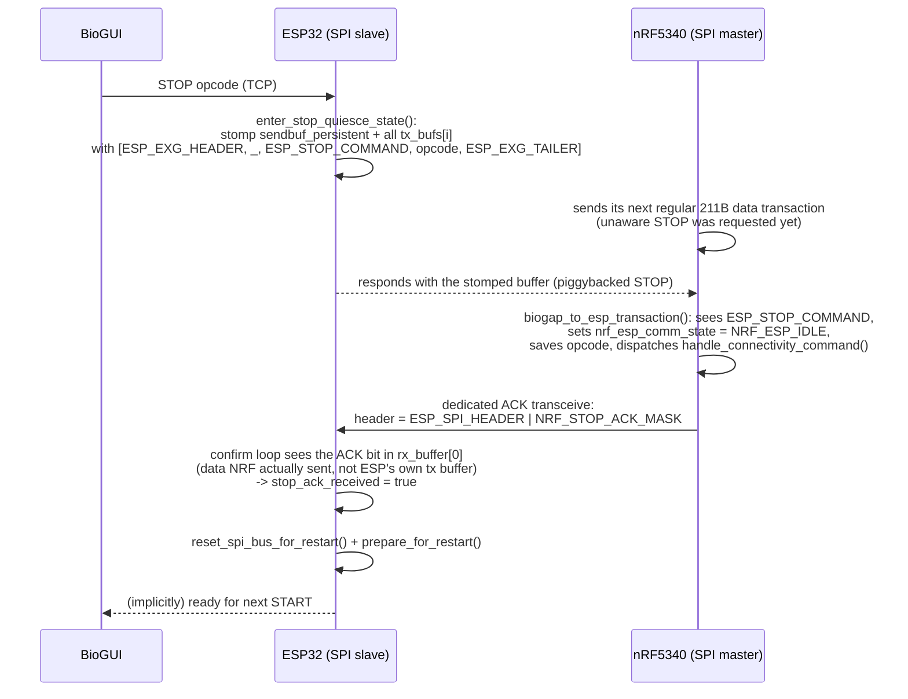

# WiFi/SD Shield Firmware (ESP32-C6)

ESP-IDF firmware for the BIOGAP Ultra WiFi/SD shield (ESP32-C6-MINI-1-H8). The ESP32
bridges the nRF5340 BIOGAP master to a laptop running BioGUI over WiFi: it terminates a
TCP connection from BioGUI, forwards START/STOP commands to the nRF over a shared SPI
link, and relays sensor data packets back to BioGUI. The nRF5340 is always the SPI
master; the ESP32 is always the SPI slave.

## Build / flash

Standard ESP-IDF project, target `esp32c6`.

```
idf.py set-target esp32c6      # first time only
idf.py build
idf.py -p <PORT> flash monitor
```

Project name: `wifi_sd_shield_v0_ap` (see [CMakeLists.txt](CMakeLists.txt)).

## Component layout

```
main/                       app_main(): boot sequence, task creation
components/common/          shared config, pin definitions, SPI/GPIO bring-up
components/biogap/          nRF <-> ESP32 SPI link (handshake, read, send, dummy-sensor test path)
components/wifi_ap/         WiFi SoftAP + TCP server + GUI command/data tasks
```

(SD-card writer, LED-strip status, and the vendored Arduino-as-component dependency it
needed have all been removed from the project — see Config flags for the now-vestigial
`ESP_ENABLE_SD_WRITE` flag.)

## State machine



### STOP handshake detail (ESP <-> nRF)



The ACK step exists because inspecting the ESP's own previously-stomped `tx_buffer`
after the transaction completes can't distinguish a genuine delivery from a torn write
(if the stomp raced an in-flight DMA transfer) -- checking `rx_buffer` is checking data
that unambiguously came from the NRF.

## Code workflow

### 1. Boot (`main/main.c`)

1. Configure a debug GPIO (`RTC_SCL`), set logging level.
2. Create the global event group `g_evt` (see Event bits below) and the SPI bus mutex.
3. `config_spi_nrf_master_esp_slave_pins()` — configure all NRF<->ESP GPIOs (data pins,
   DRDY, direction-control pins, see Pin reference below).
4. `init_nrf_spi_master_esp_slave_bus()` — bring up the SPI slave peripheral
   (`SPI2_HOST`, mode 1, DMA).
5. Block in a retry loop on `initial_handshake_nrf_master_esp_slave_pq()` until the nRF
   master completes the 4-byte handshake (see Handshake below). Sets `B_BIOGAP_CONECTED`.
6. `wifi_init_softap()` — bring up WiFi SoftAP (`bioserver` / see `EXAMPLE_ESP_WIFI_PASS`
   in `softap_main.h`), sets `B_WIFI_CONNECTED`.
7. Create the BIOGAP ring buffer (`biogap_ringbuf`, `RINGBUFF_SIZE` bytes).
8. `bind_to_gui()` — blocking TCP `accept()` on port `PORT_LAPTOP` (4444). Sets
   `B_GUI_SOCKET_BIND`; `node_state = STATE_IDLE`.
9. Spawn the four data-plane tasks (or three + the local generator, depending on
   `ESP_LOCAL_DUMMY_SENSOR`, see Config flags):
   - `read_from_biogap_task_nrf_master_esp_slave_prequeue` — SPI slave RX, nRF -> ESP.
   - `send_to_biogap_task_nrf_master_esp_slave` — SPI slave TX / command forwarding, ESP -> nRF.
   - `rx_from_gui` — TCP RX, BioGUI -> ESP (commands).
   - `tx_to_gui` — TCP TX, ESP -> BioGUI (data).

The main task then just idles forever; all real work happens in the tasks above.

### 2. Handshake (`biogap_common.c`)

`initial_handshake_nrf_master_esp_slave_pq()` arms one 4-byte SPI slave transaction of
`HANDSHAKE_MARKER` (`0x5A`) bytes and blocks until the nRF (master) clocks it out and
clocks back `HANDSHAKE_RESPONSE_MARKER` (`0xA5`) bytes. On a matching response it sets
`B_BIOGAP_CONECTED` and `handshake_pq_done = true`. Every other task that talks to the
nRF blocks on `B_BIOGAP_CONECTED` before doing anything.

### 3. GUI -> nRF command path (START)

1. BioGUI opens a TCP connection to `192.168.4.1:4444` (the ESP's SoftAP gateway
   address) and sends a single command byte (see `connectivity_commands.h`).
2. `rx_from_gui()` receives it and calls `parse_gui_command()` (`gui_utils.c`), which
   validates the opcode via `validate_command()` and, in `STATE_IDLE`, accepts only
   START-type commands: sets `rx_gui_data_to_fwd[0]` and `B_START_CMD_RCV`.
3. `send_to_biogap_task_nrf_master_esp_slave()` wakes on `B_START_CMD_RCV` and calls
   `propagate_first_start_command_to_biogap_master()`: pulses the DRDY GPIO
   (`data_ready_pulse()`, 100 us high pulse via `NRF_ESP_DATA_READY`) to tell the nRF "I
   have something for you", then blocks in `send_first_start_command_to_biogap_master()`
   on `spi_slave_transmit()` of a 4-byte control frame (`ESP_SPI_HEADER 0x66, <opcode>,
   0x00, ESP_SPI_TAILER 0xBB`) until the nRF's DRDY interrupt fires and it initiates the
   matching master transaction. This is the *same* mechanism and control-frame format
   for every START (first session or a later one after a STOP) — no special-casing.
4. Only once that control frame is confirmed delivered does it call
   `allocate_prequeue_resources()`, allocating the 211-byte DMA buffers for the
   upcoming streaming session (deliberately deferred until after the 4-byte transaction
   succeeds, not before). On success: `B_START_CMD_FWD_TO_BIOGAP` set,
   `node_state = STATE_STREAMING`.
5. `read_from_biogap_task_nrf_master_esp_slave_prequeue()`, unblocked by
   `B_START_CMD_FWD_TO_BIOGAP`, sees `!prequeued` and calls `prequeue_transactions()` to
   actually queue the `QUEUE_COUNT` (4) DMA descriptors onto the now-allocated buffers.

### 4. nRF -> GUI data path (streaming)

- `read_from_biogap_task_nrf_master_esp_slave_prequeue()` (`biogap_read.c`) keeps
  `QUEUE_COUNT` (4) DMA-capable SPI slave transactions pre-queued at all times so the
  slave is never "unarmed" between nRF-initiated transactions (see the pre-queue
  pattern doc comment at the top of that file, and `notes.md` for the throughput
  numbers that motivated it). Each completed transaction is validated
  (`NRF_EXG_HEADER 0x55` / `NRF_EXG_TAILER 0xAA`, `NRF_EXG_PACKET_SIZE` = 211 bytes),
  pushed into `biogap_ringbuf` via `add_to_ringbuffer()`, and its descriptor is
  immediately re-queued.
- `tx_to_gui()` (`gui_task.c`) drains `biogap_ringbuf` and sends each item to
  `gui_sock` via `send_all()` (below) whenever `node_state == STATE_STREAMING`.
  Always returns the dequeued item to the ring buffer regardless of send outcome --
  `biogap_ringbuf` is `RINGBUF_TYPE_NOSPLIT`, which requires items to be returned in
  the exact order they were received; leaving a failed item unreturned while later
  ones keep getting returned violates that order and corrupts the ring buffer's
  internal bookkeeping (this previously showed up as the GUI getting stuck on a
  stale/garbage packet after any single send failure).

#### Partial-write handling (`send_all()`, `gui_task.c`)

A single `send()` call is allowed to write fewer bytes than requested under
congestion -- that's normal TCP behavior, not an error. Treating a partial write as
success (a bare `send()` call does) puts a truncated packet on the wire and
permanently shifts the byte alignment of every packet sent afterward, since the
receiver has no way to know part of a packet is missing.

`send_all()` retries until the full packet is sent or it gives up, with two
different retry budgets depending on whether any bytes have actually been committed
to the wire yet for the current packet:
- **Before any bytes are sent** (`sent_total == 0`): fails fast (5 attempts, up to
  ~1s given the 200ms `SO_SNDTIMEO`) -- nothing has gone out yet, so dropping the
  whole packet is harmless.
- **After the first byte is committed**: retries far more persistently (25 attempts,
  up to ~5s) -- those bytes can't be un-sent, so giving up at that point guarantees
  a misaligned stream for every packet sent afterward. Retrying only costs time, not
  correctness.

This is a real trade-off against `biogap_ringbuf`'s capacity (`RINGBUFF_SIZE`,
200,000 bytes): while `tx_to_gui()` is blocked retrying one packet, new transactions
keep arriving from the nRF (up to 250 bytes every ~8ms at the current EEG rate) and
pile up in the ring buffer, since the consumer isn't draining it. Worst case for one
full 5s stall: ~625 transactions x 250 B = ~156 KB, leaving ~44 KB of headroom in
the 200 KB buffer -- enough for one isolated stall, but two worst-case stalls
back-to-back (without the buffer draining in between) would exceed capacity and
trigger `add_to_ringbuffer()` failures, which force a STOP (`B_RINGBUFFER_FULL` ->
`B_STOP_CMD_RCV_FORCED`, see STOP path below). If sustained/repeated congestion
turns out to be common in practice, the fix is either a bigger `RINGBUFF_SIZE` or a
smaller `max_attempts_after_commit`, trading corruption-resistance for ring-buffer
safety.

Even with this retry logic, a packet can still fail to complete after already
committing some bytes (a truly dead/exhausted link). That's an unavoidable,
permanent misalignment for that connection from that point on -- recovering from it
is BioGUI's job (below), not something the ESP side can prevent once it's happened.

#### BioGUI-side resync (`biogui/data_sources/tcp_client.py`)

`TCPClientDataSourceWorker` accepts optional `headerByte`/`tailerByte` values
(`0x55`/`0xAA` for this interface, see `interface_biogapultra_eeg.py`). If a
211-byte window doesn't have the expected byte at both positions, one byte is
dropped and parsing retries from the new offset instead of emitting a
corrupt/misaligned packet -- this is what actually recovers from any leftover
misalignment (a partial send that couldn't complete, stray startup bytes, etc.),
since the ESP side alone cannot always prevent it. Needs at least one fully intact
packet somewhere in the buffered stream to find a valid resync point; back-to-back
corrupting events with no clean packet in between can delay recovery until one
finally gets through whole.

### 5. STOP path

The ESP (slave) cannot push data to the nRF (master) unilaterally, so the STOP
*request* is delivered by piggybacking on the next regular data-transaction response;
the nRF then sends an explicit dedicated *acknowledgment* transaction back, so the ESP
has a real confirmation instead of just trusting its own previously-written buffer. See
the sequence diagram above for the full picture. In code:

1. GUI sends a STOP-type opcode while `node_state == STATE_STREAMING`;
   `parse_gui_command()` sets `B_STOP_CMD_RPT_PENDING`.
2. `rx_from_gui()` promotes this to `B_STOP_CMD_RCV_GUI` (or, on a ring-buffer overflow,
   the read task itself sets `B_STOP_CMD_RCV_FORCED` directly). It does **not** call
   any restart/cleanup function itself — `enter_stop_quiesce_state()` (below) is the
   sole owner of that sequence, to avoid two tasks racing through
   free/reinit/allocate on the same SPI bus.
3. `read_from_biogap_task_nrf_master_esp_slave_prequeue()` sees `B_STOP_CMD_RCV_GUI` /
   `B_STOP_CMD_RCV_FORCED` and calls `enter_stop_quiesce_state()`:
   - Stomps `sendbuf_persistent` and every pre-queued `tx_bufs[i]` with a STOP frame
     (`ESP_EXG_HEADER, _, ESP_STOP_COMMAND, <opcode>` at `PACKET_SZ` bytes with
     `ESP_EXG_TAILER`).
   - Polls completed transactions (`spi_slave_get_trans_result()`) checking
     `rx_buffer[0]` (what the NRF actually transmitted) for `NRF_STOP_ACK_MASK` set on
     top of `ESP_SPI_HEADER` — the NRF's explicit "I got your STOP and processed it"
     signal (see `biogap_to_esp_transaction()`, NRF side, below).
   - Once acknowledged (or on timeout — see Known issues), sets `B_SPI_QUIESCED`,
     `node_state = STATE_IDLE`, `prequeued = false`, then calls
     `reset_spi_bus_for_restart()` (frees the DMA buffers, tears down and
     reinitializes the SPI slave bus — safe now that the NRF is confirmed idle) and
     `prepare_for_restart()` (soft-flushes `biogap_ringbuf`, clears the STOP/START
     event bits) directly, itself.
4. On the NRF side, `biogap_to_esp_transaction()` (`wifi_sd_spi_functions.c`) detects
   `ESP_STOP_COMMAND` in the ESP's piggybacked response, sets
   `nrf_esp_comm_state = NRF_ESP_IDLE`, saves the opcode byte, sends the dedicated ACK
   transceive (header `ESP_SPI_HEADER | NRF_STOP_ACK_MASK`), and only then dispatches
   `handle_connectivity_command()` with the saved opcode (e.g. `STOP_DUMMY_STREAMING`
   -> `dummy_sensor_stop_streaming()`).

### State machine (`common.h`)

`node_state_t`: `STATE_DISCONNECTED` -> `STATE_IDLE` (handshake + GUI socket bound) ->
`STATE_STREAMING` (START forwarded) -> back to `STATE_IDLE` on STOP. See the diagrams
above for the full annotated flow.

### Event bits (`g_evt`, see `common.h` for the full list)

Key bits: `B_BIOGAP_CONECTED`, `B_WIFI_CONNECTED`, `B_GUI_SOCKET_BIND`,
`B_START_CMD_RCV`, `B_START_CMD_FWD_TO_BIOGAP`, `B_STOP_CMD_RCV_GUI`,
`B_STOP_CMD_RCV_FORCED`, `B_STOP_CMD_FWD_TO_BIOGAP`, `B_SPI_QUIESCED`,
`B_STOP_CMD_RPT_PENDING`, `B_RINGBUFFER_FULL`, `B_WRITING_TO_SD`.

### Framing reference

| Frame type | Header | Tailer | Size | Notes |
|---|---|---|---|---|
| ESP -> nRF control (commands) | `0x66` (`ESP_SPI_HEADER`) | `0xBB` (`ESP_SPI_TAILER`) | 4 bytes | opcode at byte[1] (START) |
| nRF -> ESP data | `0x55` (`NRF_EXG_HEADER`) | `0xAA` (`NRF_EXG_TAILER`) | 211 bytes (`NRF_EXG_PACKET_SIZE`) | real ExG and dummy-sensor packets share this format |
| ESP -> nRF piggybacked STOP request | `0x66` (`ESP_EXG_HEADER`) | `0xBB` (`ESP_EXG_TAILER`) | 211 bytes (`PACKET_SZ`) | `ESP_STOP_COMMAND` (245) at byte[2], real opcode at byte[3] — overwrites a regular streaming response buffer rather than a dedicated transfer |
| nRF -> ESP STOP acknowledgment | `ESP_SPI_HEADER \| NRF_STOP_ACK_MASK` (`0x66 \| 0x80`) | `0xBB` (`ESP_SPI_TAILER`) | 211 bytes (`send_len`) | dedicated transceive the NRF sends after fully processing the piggybacked STOP request |
| Handshake (ESP TX) | `0x5A` x4 (`HANDSHAKE_MARKER`) | - | 4 bytes | expects `0xA5` x4 (`HANDSHAKE_RESPONSE_MARKER`) echoed back |

Command opcodes are in `connectivity_commands.h` and must stay in sync with
`Firmware/src_NRF/core/connectivity_commands.h` on the nRF side.

## Pin reference (`components/common/include/pin_definitions.h`)

### NRF <-> ESP SPI (ESP is always SPI slave)

| Signal | GPIO | Direction (ESP side) | Notes |
|---|---|---|---|
| `NRF_ESP_MOSI` | 23 | input | SPI MOSI, level-translated via IC2 (`SN74AVC4T774RSVR`) |
| `NRF_ESP_MISO` | 19 | output | SPI MISO, via IC2 |
| `NRF_ESP_SCLK` | 20 | input | SPI clock, via IC2 |
| `NRF_ESP_CS`   | 21 | input | SPI chip-select, via IC2 |
| `NRF_ESP_DIR_CTRL` | 12 | output, driven **LOW** | Direction control for IC2's MOSI/MISO/CS/CLK channels. LOW = NRF is master (our only mode). An inverter (IC7, `SN74AUP1G04DBVR`) derives the complementary polarity needed for the MISO channel from this same control bit. |
| `NRF_ESP_DRDY_DIR_CTRL` | 8 | output, driven **HIGH**, fixed | Direction control for IC5's (`SN74AVC2T245RSWR`) dedicated DRDY channel. DRDY always flows ESP -> NRF regardless of SPI master role, so this is permanently HIGH (never toggled at runtime), unlike `NRF_ESP_DIR_CTRL`. |
| `NRF_ESP_DATA_READY` | 22 | output | DRDY line itself (-> nRF's `SPI_NRF_ESP_DRDY` / QSPI_IO2). Pulsed high for ~100 us (`NRF_DRDY_PULSE_US`) by `data_ready_pulse()` whenever the ESP has a command frame ready for the nRF to pick up. |

Both `NRF_ESP_DIR_CTRL` and `NRF_ESP_DRDY_DIR_CTRL` are configured and driven once at
boot in `config_spi_nrf_master_esp_slave_pins()` (`common.c`) and never change again at
runtime — the shield's bus direction is fixed for the "nRF is SPI master" topology this
firmware implements.

### SD card SPI (pins reserved on the shield; the SD-writer component that used them has been removed)

| Signal | GPIO | Notes |
|---|---|---|
| `ESP_SD_MOSI` | 7 | -> SD `mSD_CMD`/CMD |
| `ESP_SD_MISO` | 2 | <- SD `mSD_DAT0`/DAT0 |
| `ESP_SD_CLK`  | 6 | SD clock |
| `ESP_SD_CS`   | 18 | -> SD `mSD_DAT3`/CS (SPI mode) |
| `ESP_SDCTRL`  | 9 | Controls whether ESP writes directly to the SD card |

### RTC

| Signal | GPIO | Notes |
|---|---|---|
| `RTC_SCL` | 15 | Also reused as a general debug/status GPIO in `main.c` |
| `RTC_SDA` | 14 | |
| `RTC_ON`  | 13 | Enable/disable the RTC |
| `RTC_FOUT` | 4 | |
| `RTC_CLKOUT` | 3 | |

## Config flags (`components/common/include/shield_config.h`)

| Flag | Default | Meaning |
|---|---|---|
| `IS_WBAN` | 0 | Multi-node WBAN accept-loop mode (not yet implemented, `main.c` has a stubbed-out call site). |
| `IS_ESP_SPI_SLAVE` | 1 | ESP is always the SPI slave, nRF the master. No other mode is currently supported end-to-end. |
| `ESP_ENABLE_SD_WRITE` | 0 | Was intended to enable an SD-card write task; the `sdcard_spi` component has since been removed from the project, so this is now vestigial — leave at 0 (setting it to 1 will fail to build until/unless SD support is reintroduced). |
| `ESP_LOCAL_DUMMY_SENSOR` | 0 | When 1, bypasses SPI/nRF entirely: the ESP generates synthetic dummy-sensor packets locally (`dummy_sensor_local.c`, byte-identical wire format to the nRF's `dummy_sensor_appl.c`) and streams them straight to BioGUI. Useful for testing the WiFi/GUI half of the system in isolation, with no nRF/SPI hardware attached. When 0 (real integration), the SPI/handshake bring-up in `main.c` runs and the real SPI read/send tasks are created instead. |

## WiFi / TCP

- SoftAP SSID: `bioserver` (`EXAMPLE_ESP_WIFI_SSID`, `softap_main.h`), password
  `EXAMPLE_ESP_WIFI_PASS`, channel `EXAMPLE_ESP_WIFI_CHANNEL`.
- BioGUI connects as a TCP client to `192.168.4.1:4444` (`PORT_LAPTOP`), the ESP's
  default SoftAP gateway address. Single connection only (`accept()` is called once;
  see Known issues).
- `PORT_ESP_NODE` (3333) is reserved for the unimplemented `IS_WBAN` multi-node mode.

## Known issues / not yet implemented

Actively being worked on:

- **STOP confirm loop doesn't re-queue non-matching reaps** (`enter_stop_quiesce_state()`,
  `biogap_read.c`): each transaction reaped while waiting for the NRF's ACK is
  permanently consumed rather than re-queued. With only `QUEUE_COUNT` (4) descriptors,
  if more than 4 regular transactions complete before the ACK arrives — increasingly
  likely at high sample rates (e.g. ~1ms sensor period, ~250x the original ~400ms
  cadence) — the SPI slave queue can run dry before the ACK is ever seen, and the
  NRF's next transaction then reads back `0xFF/0xFF` and halts.

Other known limitations:

- `bind_to_gui()` creates a brand-new listening socket for every session rather than
  binding/listening once at boot; there's a short window between the old connection
  closing and the new `listen()` call where a client's connection attempt gets
  "Connection refused." BioGUI's own retry button covers this today.
- The malformed/misframed-packet path in `biogap_read.c`'s main streaming loop calls
  `break` (kills the read task) rather than logging and continuing — a single corrupted
  SPI transaction can currently take down streaming.
