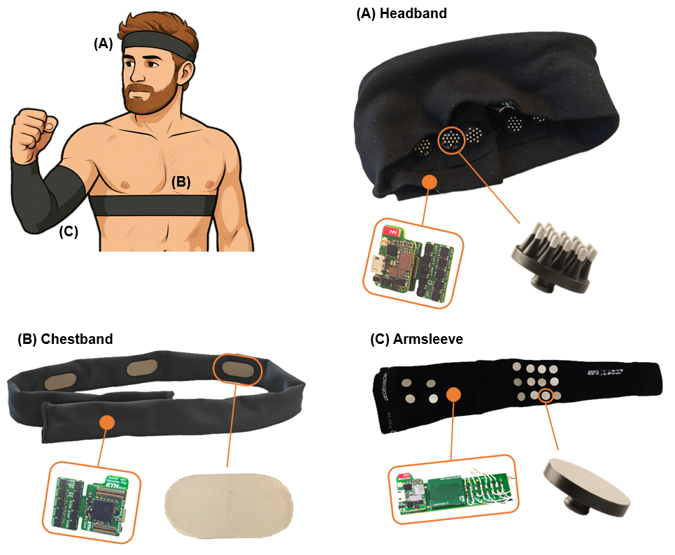

# BioGAP-Ultra

### A modular edge-AI platform for wearable multimodal biosignal acquisition and processing

[BioGAP-Ultra](https://doi.org/10.1109/TBCAS.2026.3652501) is an open-source, ultra-low-power platform for synchronized multimodal biosignal acquisition, wireless streaming, and on-device inference. Its stackable architecture combines a compact mainboard with application-specific sensing shields, enabling the same processing platform to be integrated into headbands, armbands, chestbands, and custom wearable devices.

The mainboard pairs a **GAP9** parallel ultra-low-power processor for digital signal processing and neural-network inference with an **nRF5340** for sensor control and Bluetooth Low Energy (BLE) connectivity. Available sensing modules support **EEG, EMG, ECG, PPG, 3-axis acceleration, QVAR, and audio** acquisition.

<p align="center">
  
</p>


## Key Features

- **Modular and extensible hardware:** stackable sensing shields and standardized interfaces for rapid adaptation to new biosignals and wearable form factors.
- **High-channel-count biopotential acquisition:** 16 simultaneous 24-bit ExG channels per shield, configurable for EEG, EMG, or ECG measurements.
- **Energy-efficient edge AI:** GAP9 with a programmable 9-core RISC-V cluster and NE16 neural accelerator, delivering up to 15.6 GOPS for DSP and 32.2 GMAC/s for machine learning at 370 MHz.
- **High-throughput wireless streaming:** nRF5340 with BLE 5.4 and a measured application throughput of up to 1.4 Mbit/s.
- **Large on-device memory:** 512 Mbit GAP9 PSRAM, 512 Mbit non-volatile flash, and 128 Mbit nRF5340 PSRAM for model storage, intermediate results, and temporary stream buffering.
- **Multimodal synchronization:** shared timing and firmware-level synchronization across concurrently active sensing modules.
- **Flexible expansion:** two I2C buses, two SPI buses, MIPI CSI-2, PDM audio, QSPI, and GPIO interfaces are exposed through the board-to-board connectors.
- **Compact mainboard:** 15 mm x 25 mm after removal of the breakaway development section.
- **Open research platform:** hardware, firmware, documentation, and expansion-board templates are provided for reproduction and further development.

## Demonstrated Wearable Configurations

The platform was experimentally validated in three fully wearable form factors. Power values include continuous acquisition and BLE streaming; battery-life estimates use a 150 mAh LiPo battery.

| Form factor | Acquired signals | Streaming power | Battery life |
| --- | --- | ---: | ---: |
| EEG-PPG headband | 16-channel EEG, PPG, acceleration | 32.8 mW | 16.9 h |
| EMG sleeve | 16-channel EMG, acceleration | 26.7 mW | 20.8 h |
| ECG-PPG chestband | Single-channel ECG, PPG, acceleration | 9.3 mW | 59.7 h |

Two representative real-time processing pipelines demonstrate the platform's on-device capabilities:

| Application | Processor | Result | System power |
| --- | --- | --- | ---: |
| ECG-PPG pulse-arrival-time estimation | nRF5340 | Real-time Pan-Tompkins-based processing | 8.6 mW |
| EMG-ACC reach-and-grasp phase classification | GAP9 | 79.9% +/- 5.7% accuracy; less than 5 ms per inference | 23.6 mW |

More details are available in the [BioGAP-Ultra paper](https://doi.org/10.1109/TBCAS.2026.3652501).

## Hardware

| Board | Description |
| --- | --- |
| **Mainboard** | Core processing, power-management, memory, and wireless-connectivity board integrating the GAP9, nRF5340, MAX77654 PMIC, accelerometer/QVAR sensor, and PDM microphone. |
| **ExG shield** | Stackable 16-channel biopotential acquisition board based on two ADS1298 AFEs. It supports active or passive electrodes, monopolar or bipolar montages, configurable gain, and single- or dual-supply assembly options. |
| **EMG shield** | Stackable 16-channel ADS1298-based board with interchangeable electrode-routing boards for fully differential, partially shared, or common-reference configurations. |
| **PPG shield** | Compact red/infrared optical sensing board designed for flexible placement, including integration into an earlobe clip. |
| **Debug board** | Exposes power rails, communication buses, GPIOs, status LEDs, buttons, and programming/debug interfaces for the nRF5340 and GAP9. |
| **Template shield** | Reference design with pre-routed connectors for developing custom BioGAP-compatible sensing and expansion boards. |

The hardware projects are included as Git submodules. Clone the repository recursively to retrieve them.

## Repository Structure

| Path | Contents |
| --- | --- |
| [`Hardware/`](Hardware/) | Mainboard, ExG, EMG, PPG, debug-board, and template-shield hardware projects, included as Git submodules. |
| [`Firmware/`](Firmware/) | nRF5340 firmware, build configuration, sensor drivers, protocol documentation, and utilities. |
| [`Firmware/src_NRF/`](Firmware/src_NRF/) | Zephyr application for acquisition, power management, synchronization, command handling, and BLE streaming. |
| [`Firmware/src_NRF/sensors/`](Firmware/src_NRF/sensors/) | Sensor modules for EEG, EMG, IMU, microphone, PPG, mmWave radar, and WULPUS integration. |
| [`Documentation/firmware/`](Documentation/firmware/) | Firmware architecture, configuration, protocol, data-format, and setup guides. |
| [`Documentation/`](Documentation/) | System-level documentation and images used by this README. |
| [`Changelog.md`](Changelog.md) | Hardware and repository revision history. |

## Getting Started

### 1. Clone BioGAP-Ultra and its hardware submodules

```bash
git clone --recurse-submodules --branch feature/FW-refactoring https://github.com/pulp-bio/BioGAP.git
cd BioGAP
```

If the repository has already been cloned without its submodules, initialize them with:

```bash
git submodule update --init --recursive
```

### 2. Set up the firmware environment

The nRF5340 firmware uses **nRF Connect SDK v2.6.1**, Zephyr RTOS, and the custom [SENSEI SDK](https://github.com/pulp-bio/sensei-sdk). Follow the [firmware getting-started guide](Documentation/firmware/getting_started.md) to install the toolchain, select a sensing configuration, build the application, and flash the board.

The command-line build uses the custom BioGAP board target:

```bash
west build --build-dir <build-dir> <path-to-BioGAP>/Firmware/src_NRF \
  --board nrf5340_senseiv1_cpuapp --pristine
west flash --build-dir <build-dir>
```

### 3. Connect a host application

For desktop acquisition, visualization, recording, and live inference workflows, use [BioGUI](https://github.com/pulp-bio/biogui). BLE commands and binary packet formats are documented in the [BLE protocol](Documentation/firmware/ble_protocol.md) and [data-format reference](Documentation/firmware/data_formats.md).

## Documentation

- [Firmware documentation index](Documentation/firmware/README.md)
- [Getting started](Documentation/firmware/getting_started.md)
- [Firmware architecture](Documentation/firmware/architecture.md)
- [Firmware configuration](Documentation/firmware/configuration.md)
- [BLE command protocol](Documentation/firmware/ble_protocol.md)
- [BLE data formats](Documentation/firmware/data_formats.md)
- [Sensor modules](Documentation/firmware/sensor_modules.md)
- [Hardware changelog](Changelog.md)

## Citation

If BioGAP contributes to your research, please cite:

```bibtex
@ARTICLE{Frey_2026_BioGAP_Ultra,
  author={Frey, Sebastian and Spacone, Giusy and Cossettini, Andrea and Guermandi, Marco and Schilk, Philipp and Benini, Luca and Kartsch, Victor},
  journal={IEEE Transactions on Biomedical Circuits and Systems},
  title={BioGAP-Ultra: A Modular Edge-AI Platform for Wearable Multimodal Biosignal Acquisition and Processing},
  year={2026},
  volume={20},
  number={3},
  pages={399--415},
  keywords={Electrocardiography; Biomedical monitoring; Monitoring; Electromyography; Electroencephalography; Artificial intelligence; Heart rate; Estimation; Temperature measurement; Hardware; Biopotential; ExG; photoplethysmogram; human-machine interface; sensor fusion},
  doi={10.1109/TBCAS.2026.3652501}
}
```
```bibtex
@INPROCEEDINGS{Frey_2023_BioGAP,
  author={Frey, Sebastian and Guermandi, Marco and Benatti, Simone and Kartsch, Victor and Cossettini, Andrea and Benini, Luca},
  booktitle={2023 IEEE International Conference on Omni-layer Intelligent Systems (COINS)}, 
  title={BioGAP: a 10-Core FP-capable Ultra-Low Power IoT Processor, with Medical-Grade AFE and BLE Connectivity for Wearable Biosignal Processing}, 
  year={2023},
  volume={},
  number={},
  pages={1-7},
  keywords={Wireless communication;6G mobile communication;Wireless sensor networks;Ultrasonic imaging;Wearable computers;Machine learning;Electroencephalography;wearable EEG;wearable healthcare;ultra-low-power design;embedded system},
  doi={10.1109/COINS57856.2023.10189286}}
```

## Works Using BioGAP

1. Frey, Sebastian, et al. "GAPses: Versatile smart glasses for comfortable and fully-dry acquisition and parallel ultra-low-power processing of EEG and EOG." *IEEE Transactions on Biomedical Circuits and Systems* 19.3 (2024): 616-628.
2. Santos, Carlos, et al. "Real-time, single-ear, wearable ECG reconstruction, R-peak detection, and HR/HRV monitoring." *2025 47th Annual International Conference of the IEEE Engineering in Medicine and Biology Society (EMBC)*. IEEE, 2025.
3. Orlandi, Mattia, et al. "Real-time motor unit tracking from sEMG signals with adaptive ICA on a parallel ultra-low-power processor." *IEEE Transactions on Biomedical Circuits and Systems* 18.4 (2024): 771-782.
4. Frey, Sebastian, et al. "A wearable ultra-low-power sEMG-triggered ultrasound system for long-term muscle activity monitoring." *2023 IEEE International Ultrasonics Symposium (IUS)*. IEEE, 2023.
5. Ingolfsson, Thorir Mar, et al. "A wearable ultra-low-power system for EEG-based speech-imagery interfaces." *IEEE Transactions on Biomedical Circuits and Systems* 19.4 (2025): 743-755.
6. Mei, Lan, et al. "An ultra-low-power wearable BMI system with continual learning capabilities." *IEEE Transactions on Biomedical Circuits and Systems* 19.3 (2024): 511-522.
7. Meier, Fiona, et al. "A parallel ultra-low-power silent speech interface based on a wearable, fully-dry EMG neckband." *2025 IEEE SENSORS*. IEEE, 2025.
8. Frey, Sebastian, et al. "Live Demonstration: Wearable Edge-AI Meets Real-Time Saccadic Eye Movement Classification." *2025 IEEE Biomedical Circuits and Systems Conference (BioCAS)*. IEEE, 2025, p. 539. https://doi.org/10.1109/BioCAS67066.2025.00126.
9. Ingolfsson, Thorir Mar, et al. "VowelNet: Enhancing communication with wearable EEG-based vowel imagery." *2024 IEEE Biomedical Circuits and Systems Conference (BioCAS)*. IEEE, 2024.
10. Spacone, Giusy, et al. "Wearable and ultra-low-power fusion of EMG and A-mode US for hand-wrist kinematic tracking." *2025 IEEE Biomedical Circuits and Systems Conference (BioCAS)*. IEEE, 2025.
11. Frey, Sebastian, et al. "Wearable, real-time drowsiness detection based on EEG-PPG sensor fusion at the edge." *2024 IEEE Biomedical Circuits and Systems Conference (BioCAS)*. IEEE, 2024.
12. Orlandi, Mattia, et al. "An adaptive dynamic mixing model for sEMG real-time ICA on an ultra-low-power processor." *2023 IEEE Biomedical Circuits and Systems Conference (BioCAS)*. IEEE, 2023.

## Contributors

BioGAP-Ultra was developed at the [Integrated Systems Laboratory (IIS)](https://iis.ee.ethz.ch/) at ETH Zurich by:

- [Sebastian Frey](https://scholar.google.com/citations?user=7jhiqz4AAAAJ&hl=en) - Hardware, firmware, software, and documentation
- [Victor Kartsch](https://scholar.google.com/citations?user=0LY6szsAAAAJ&hl=en) - Software and conceptualization
- [Giusy Spacone](https://scholar.google.com/citations?user=dGE8uMEAAAAJ&hl=en) - Firmware
- [Giovanni Pollo](https://scholar.google.com/citations?user=znSV3doAAAAJ&hl=en&oi=ao) - Firmware
- [Philipp Schilk](https://scholar.google.com/citations?user=2DB8gDwAAAAJ&hl=en&oi=sra) - Firmware
- [Marco Guermandi](https://scholar.google.com/citations?user=w_MZF8IAAAAJ&hl=en) - Conceptualization
- [Luca Benini](https://scholar.google.com/citations?hl=en&user=8riq3sYAAAAJ) - Supervision and conceptualization
- [Andrea Cossettini](https://scholar.google.com/citations?user=d8O91jIAAAAJ&hl=en) - Supervision and conceptualization

## License

- Hardware design files are released under the [Solderpad Hardware License v0.51](LICENSE.hw).
- Firmware in [`Firmware/`](Firmware/) is released under the [Apache License 2.0](Firmware/LICENSE).
- Images are released under the [Creative Commons Attribution 4.0 International License](LICENSE.images).

Hardware submodules and third-party source files may include their own license terms. Consult the corresponding repositories and source headers before redistribution.
